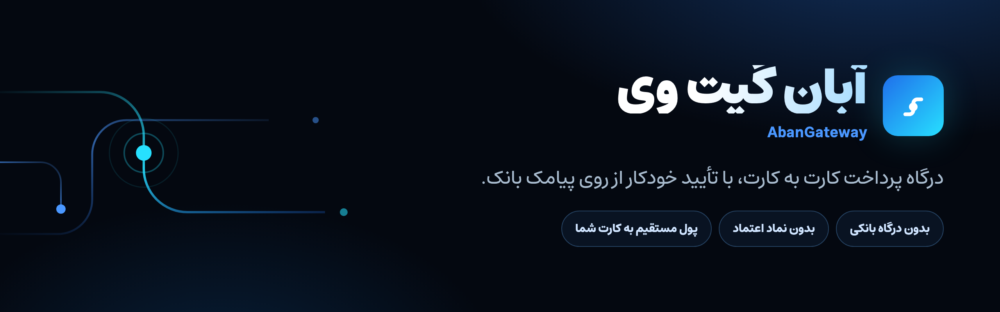
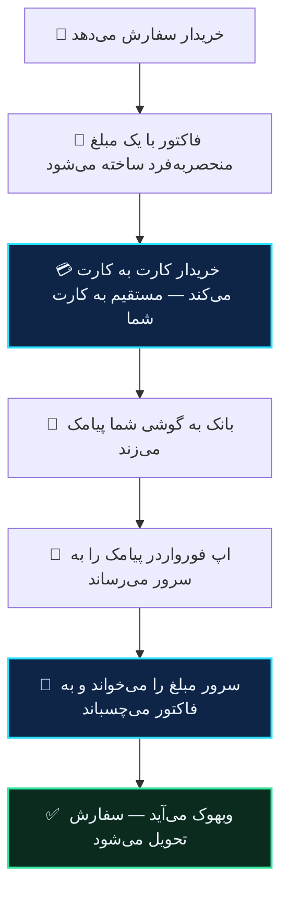
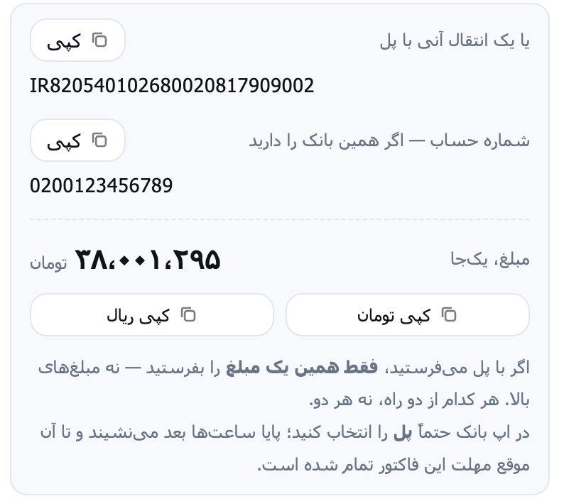

<div align="center">



**درگاه پرداخت کارت به کارت، با تأیید خودکار از روی پیامک بانک.**
پول مستقیم به کارت خودتان می‌رود — نه به حساب ما، نه به حساب هیچ‌کس دیگر.

<!-- Latin labels on purpose. shields.io renders the badge text as SVG with no
     Persian font and no bidi handling, so a Persian label comes out reordered
     and boxy — it was tried and it looked broken, which is worse than plain. -->
[](https://abangateway.ir)
[](https://abangateway.ir/status)
[](api/README.md)
[](https://play.google.com/store/apps/details?id=ir.abangateway.forwarder)
[](integrations/woocommerce.md)
[](https://t.me/Abangw_bot)
[](https://t.me/abangateway)

</div>

---

## ⚡ در سی ثانیه

```bash
curl -X POST https://api.abangateway.ir/api/v1/invoices \
  -H "Authorization: Bearer $ABAN_TOKEN" \
  -H "Content-Type: application/json" \
  -d '{"amount_rial": 5990000, "order_id": "ORD-1043",
       "callback_url": "https://shop.example/hook"}'
```

```json
{
  "invoice_id": "inv_9fk2m4qx7t3p8wzy1a6b",
  "payable_rial": 5993240,
  "card_number": "6037991234567890",
  "payment_url": "https://abangateway.ir/pay/inv_9fk2m4qx7t3p8wzy1a6b"
}
```

خریدار را به `payment_url` بفرستید. وقتی واریز کرد، وبهوک می‌آید. تمام.

---

## 🧭 چطور کار می‌کند

هر فاکتور یک مبلغ **منحصربه‌فرد** می‌گیرد — چند ریال بیشتر از مبلغ سفارش. آن اختلاف تصادفی تنها چیزی است که واریز این خریدار را از واریز همزمان یک نفر دیگر جدا می‌کند.

<!-- Top-down, not right-to-left. RTL matched the language and was the first
     choice, but seven nodes on one horizontal line render as an unreadable
     strip of thumbnails on GitHub. A vertical flow gives each step the full
     column width, which is what actually makes it legible. -->


پول در هیچ مرحله‌ای دست ما نیست. کارمزد از یک کیف پول جدا کم می‌شود که خودتان شارژ می‌کنید.

---

## 🆕 دو راه پرداخت، نه یکی

شبا و شماره حساب کارتتان را هم می‌شود ثبت کرد. اگر ثبت کنید، صفحه‌ی پرداخت راه دومی جلوی خریدار می‌گذارد: **یک انتقال آنی با پل**، به‌جای کارت به کارت.

<div align="center">



</div>

این برای فاکتور بزرگ فرق می‌کند. سقفی که فاکتور را تکه می‌کند سقف **کارت** است، نه سقف حساب — پس همان فاکتور سه‌تکه با یک انتقال هم پرداخت می‌شود. خریدار یکی از دو راه را انتخاب می‌کند، نه هر دو را.

تطبیق برای هر دو یکی است: سیستم روی مبلغ یکتا کار می‌کند، نه روی مسیر پول. پیامک واریز حساب به حساب هم مثل کارت به کارت خوانده و تأیید می‌شود.

> [!NOTE]
> **ویرایش کارت** هم اضافه شد: نام دارنده، نام بانک، شبا، شماره حساب و خود شماره کارت. تا پیش از این فقط حذف و غیرفعال‌سازی بود و برای عوض کردن یک رقم باید کارت را از نو می‌ساختید. تنها استثنا شماره‌ی کارتی است که فاکتور بازی روی آن هست — خریداری که صفحه‌ی پرداخت را باز کرده همان شماره را دیده.

هر دو از **پنل** و از **ربات تلگرام** در دسترس‌اند. [سقف کارت به کارت و راه دوم ←](guides/card-to-card-ceiling.md)

---

## ⚖️ با درگاه شاپرکی چه فرقی دارد

<div dir="rtl">

| | 🔵 آبان گیت وی | ⚪ درگاه شاپرکی |
|---|---|---|
| نماد اعتماد | ✅ لازم نیست | ❌ الزامی |
| قرارداد و مجوز | ✅ لازم نیست | ❌ الزامی |
| راه‌اندازی | ✅ چند دقیقه | ❌ چند هفته |
| پول اول کجا می‌نشیند | ✅ کارت خودتان | ❌ حساب پذیرنده PSP |
| تسویه | ✅ تسویه‌ای در کار نیست | ❌ چرخه‌ی تسویه |
| کارمزد | پلکانی، از کیف پول | درصدی، از تراکنش |

</div>

[توضیح کامل تفاوت‌ها ←](https://abangateway.ir/blog/تفاوت-کارت-به-کارت-با-شاپرک)

---

## 🚀 از کجا شروع کنم

<table dir="rtl">
<tr>
<td width="25%" valign="top">

### 🛍 فروشنده‌ام
سایت ندارم

[لینک پرداخت](integrations/payment-links.md)

</td>
<td width="25%" valign="top">

### 🟣 ووکامرس دارم

[افزونه‌ی رسمی](integrations/woocommerce.md)

### 🤖 ربات فروشگاهی دارم

[DDbot](integrations/ddbot.md) · [میرزا آپدیت‌شده](integrations/mirza-pro.md) · [میرزا قدیمی](integrations/mirza.md) · [فاکسیما](integrations/faoxima.md) · [ویزویز](integrations/wizwiz.md)

</td>
<td width="25%" valign="top">

### 👨‍💻 برنامه‌نویسم

[مرجع API](api/README.md)

</td>
<td width="25%" valign="top">

### 🌱 تازه‌ام

[از صفر تا اولین پرداخت](guides/start.md)

</td>
</tr>
</table>

---

## 📚 فهرست کامل

### 🔌 API

<div dir="rtl">

| صفحه | چه چیزی |
|---|---|
| [مرور کلی](api/README.md) | احراز هویت، مبلغ‌ها، محدودیت نرخ، سازگاری |
| [فاکتورها](api/invoices.md) | ساخت · خواندن · تأیید · لغو · شبیه‌سازی |
| [وبهوک](api/webhooks.md) | رویدادها، هدرها، راستی‌آزمایی امضا، تلاش مجدد |
| [خطاها](api/errors.md) | فهرست کامل کدها و آنچه واقعاً پیش می‌آید |
| [`openapi.json`](api/openapi.json) | 🤖 از روی کد تولید می‌شود |

</div>

### 🧩 اتصال

<div dir="rtl">

| صفحه | چه چیزی |
|---|---|
| [ووکامرس](integrations/woocommerce.md) | نصب، تنظیمات، وضعیت سفارش، عیب‌یابی |
| [DDbot](integrations/ddbot.md) | ربات فروشگاهی تلگرام، بدون نصب چیزی روی سرور شما |
| [میرزا آپدیت‌شده](integrations/mirza-pro.md) | آبان گیت وی داخل خود ربات؛ یک آدرس و یک کلید |
| [میرزا قدیمی](integrations/mirza.md) | نسخه‌های قدیمی‌تر، به‌عنوان درگاه سفارشی |
| [فاکسیما](integrations/faoxima.md) | ربات فاکسیما روی سرور خودتان، با نصب‌کننده‌ی یک‌دستوری |
| [ویزویز](integrations/wizwiz.md) | ربات ویزویز روی سرور خودتان، جای درگاه NowPayments |
| [لینک پرداخت](integrations/payment-links.md) | بدون کد، برای فروش در اینستاگرام و تلگرام |
| [اپ فورواردر](integrations/forwarder-app.md) | همان چیزی که پیامک بانک را می‌رساند — گوگل پلی یا دانلود مستقیم |

</div>

### 💻 نمونه‌کد

[**PHP**](examples/php.md) · [**Python**](examples/python.md) · [**curl**](examples/curl.md)

هر سه یک چرخه‌ی کامل‌اند: بساز، وبهوک را بشنو، سفارش را تحویل بده.

### 📖 راهنمای فروشنده

<div dir="rtl">

| راهنما | برای چه سؤالی |
|---|---|
| [از صفر تا اولین پرداخت](guides/start.md) | «چطور شروع کنم؟» |
| [تطبیق چطور کار می‌کند](guides/how-matching-works.md) | «از کجا می‌فهمید کدام واریز مال کدام سفارش است؟» |
| [سقف کارت به کارت](guides/card-to-card-ceiling.md) | «فاکتور ۵۰ میلیونی چه می‌شود؟» |
| [چرا پرداختم تأیید نشد](guides/why-not-settled.md) | «پول رفته ولی سفارش بسته نشده» |
| [حالت آفلاین](guides/offline-mode.md) | «اینترنت گوشی قطع شود چه؟» |
| [کارمزد](guides/fees.md) | «چقدر برمی‌دارید؟» |
| [همکار و صندوق دار](guides/team-roles.md) | «میخواهم یک نفر فقط فاکتور بزند و پرداختی ها را ببیند» |
| [لینک پرداخت به دست مشتری](guides/send-link-to-customer.md) | «لینک را چطور بفرستم؟ QR دارید؟» |
| [اعلان در گروه تلگرام](guides/telegram-group-alerts.md) | «واریزها به گروه فروشگاه هم بیاید» |

</div>

---

## ⚠️ سه چیزی که موقع اتصال اشتباه می‌شود

> [!WARNING]
> **۱. مبلغ اشتباه را نشان می‌دهید.**
> `payable_rial` را نشان دهید، نه `amount_rial`. اگر خریدار عدد رُند بفرستد، سیستم نمی‌تواند تشخیصش بدهد و سفارش به صف بررسی دستی می‌رود.

> [!WARNING]
> **۲. امضای وبهوک را چک نمی‌کنید.**
> بدون آن، هرکسی می‌تواند سفارش تحویل‌نشده را «پرداخت‌شده» جا بزند. [چطور چک کنیم ←](api/webhooks.md)

> [!NOTE]
> **۳. خطا حساب کردن `already_verified`.**
> خطا نیست — یعنی سفارش قبلاً تحویل شده. مثل موفقیت رفتارش کنید.

---

## 🧪 تست، بدون اینکه ریالی جابه‌جا شود

با توکن `ag_test_` همه‌چیز واقعی است جز پول: فاکتور ساخته می‌شود، صفحه‌ی پرداخت باز می‌شود، وبهوک با امضای واقعی می‌آید.

```bash
curl -X POST "https://api.abangateway.ir/api/v1/invoices/$ID/simulate-payment" \
  -H "Authorization: Bearer $ABAN_TEST_TOKEN"
```

---

## 🔗 ارتباط

<div dir="rtl">

| | |
|---|---|
| 🌐 وب‌سایت | [abangateway.ir](https://abangateway.ir) |
| 📊 وضعیت سرویس | [abangateway.ir/status](https://abangateway.ir/status) |
| 🤖 ربات تلگرام | [@Abangw_bot](https://t.me/Abangw_bot) |
| 📣 کانال تلگرام | [@abangateway](https://t.me/abangateway) |
| ✉️ ایمیل | info@abangateway.ir |
| 🐛 ایراد در مستندات | [Issue باز کنید](../../issues) |

</div>

---

<div align="center">
<sub>

پوشه‌ی `guides/` و فایل `api/openapi.json` **تولید می‌شوند** — از روی همان چیزی که سایت و سرور واقعاً اجرا می‌کنند، تا با محصول اختلاف پیدا نکنند. دستی ویرایششان نکنید.

اگر جایی از این مستندات با رفتار واقعی سرویس نمی‌خواند، همان یک باگ است.

</sub>
</div>
