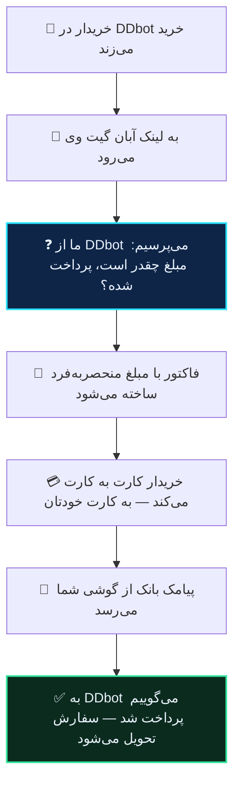

# DDbot

ربات فروشگاهی DDbot می‌تواند آبان گیت وی را به‌عنوان درگاه شخصی‌اش استفاده کند. **چیزی روی سرور شما نصب نمی‌شود** و کدی نمی‌نویسید — همه‌چیز بین دو سرویس رد و بدل می‌شود.

## اتصال

در **ربات آبان گیت وی**:

۱. **تنظیمات** ← **🤖 اتصال به ربات‌ها** ← **➕ اتصال ربات جدید**
۲. آدرس پایه و کلید API که از DDbot گرفته‌اید را بدهید، و یک اسم برایش بگذارید.
۳. ربات یک لینک به شما می‌دهد. کپی‌اش کنید.

در **DDbot**:

۴. **تنظیمات پرداخت** ← **تنظیم آدرس درگاه شخصی**
۵. همان لینک را اینجا بگذارید.
۶. در **🚦 وضعیت درگاه‌ها**، **درگاه شخصی** را روشن کنید.

تمام.

> [!WARNING]
> **به انتهای لینک چیزی اضافه نکنید.** DDbot خودش `?order_id=…` را به آن می‌چسباند. اگر لینک از قبل علامت سؤال داشته باشد، آدرس خراب می‌شود.

> [!NOTE]
> اگر **درگاه شخصی** در «وضعیت درگاه‌ها» روشن نباشد، DDbot خریدار را اصلاً به این لینک نمی‌فرستد و انگار هیچ اتصالی برقرار نشده. این شایع‌ترین دلیل «کار نمی‌کند» است.

## چه اتفاقی می‌افتد

آن قدم سوم الزام خود DDbot است: قبل از فرستادن خریدار به پرداخت، وضعیت سفارش پرسیده می‌شود تا سفارشی که یک بار پرداخت شده دوباره پرداخت نشود.

## مبلغ

DDbot مبلغ را به **تومان** می‌دهد و آبان گیت وی با **ریال** کار می‌کند. تبدیل خودکار است و کاری با آن ندارید.

چیزی که خریدار می‌پردازد چند ریال بیشتر از مبلغ سفارش است — همان اختلاف تصادفی که واریزش را قابل تشخیص می‌کند. [توضیح کامل](../guides/how-matching-works.md).

## اگر خریدار لینک را چند بار باز کند

فاکتور دوم ساخته نمی‌شود. همان فاکتور باز قبلی را می‌بیند، با همان مبلغ. یعنی نه کارمزد دوباره رزرو می‌شود و نه دو مبلغ مختلف سرگردان می‌ماند.

## تأیید به DDbot

وقتی پیامک بانک رسید و فاکتور تسویه شد، خودکار به DDbot خبر می‌دهیم.

اگر DDbot در آن لحظه جواب ندهد، **پنج بار تلاش می‌شود** — بعد از ۱۰ ثانیه، ۳۰ ثانیه، ۲ دقیقه، ۱۰ دقیقه و ۱ ساعت. هر سفارش دقیقاً یک بار تأیید می‌شود، هرچند بار که پیامک یا رویداد تکرار شود.

اگر DDbot صریحاً رد کند — مثلاً بگوید سفارش قبلاً پرداخت شده — همان پیام خودش ثبت می‌شود، نه یک «موفق» ساختگی.

## چند فروشگاه

هر اتصال یک لینک جدا دارد. اگر چند ربات DDbot دارید، برای هرکدام یک اتصال بسازید.

## کلید API را مثل رمز نگه دارید

پروتکل DDbot کلید را در آدرس (query string) می‌فرستد، نه در هدر. یعنی در لاگ سرورها و تاریخچه‌ی مرورگر می‌نشیند — طراحی آنهاست و از سمت ما قابل تغییر نیست.

ما کلید را رمزشده نگه می‌داریم و هیچ‌جای دیگری نمی‌نویسیم. ولی اگر فکر می‌کنید جایی لو رفته، از پنل DDbot عوضش کنید و در ربات آبان گیت وی دوباره واردش کنید.

## وقتی کار نمی‌کند

**«لینک را می‌زنم، صفحه‌ی ۴۰۴ می‌آید»** — لینک را کامل و بدون تغییر کپی کنید. چیزی به آخرش اضافه نکنید.

**«خریدار اصلاً به آبان گیت وی نمی‌رسد»** — در DDbot، **🚦 وضعیت درگاه‌ها ← درگاه شخصی** خاموش است.

**«ربات فروشگاه پاسخ نداد»** — آدرس پایه یا کلید API اشتباه است. صفحه‌ای که خریدار می‌بیند پیام خود DDbot را هم نشان می‌دهد.

**«پول رسید ولی سفارش در DDbot تحویل نشد»** — تأیید در حال تلاش مجدد است، یا DDbot ردش کرده. با پشتیبانی تماس بگیرید؛ ما دلیل دقیق و همه‌ی تلاش‌ها را ثبت کرده‌ایم.

**«پرداخت شد ولی فاکتور تأیید نشد»** — این ربطی به DDbot ندارد و مسئله‌ی سمت گوشی است: [چرا پرداختم تأیید نشد](../guides/why-not-settled.md).
