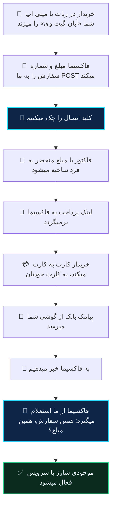
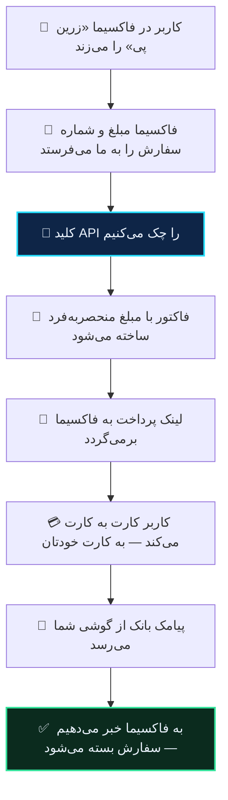

# فاکسیما

آبان گیت وی یکی از درگاه های خود فاکسیماست. چیزی روی سرور شما نصب نمیشود، فایلی آپلود نمیکنید و هیچ درگاه دیگری از کار نمیافتد: دو مقدار از ربات ما میگیرید و در پنل مدیریت فاکسیما میگذارید.

> [!NOTE]
> این درگاه از ۳۰ شهریور ۱۴۰۵ در شاخه اصلی فاکسیماست و در نسخه های رسمی **بعد از ۱٫۰٫۵** میآید. نسخه ۱٫۰٫۵ و قبل از آن این درگاه را ندارند.
>
> اگر در فهرست درگاه های رباتتان «آبان گیت وی» را نمیبینید، فاکسیمای شما هنوز آن را ندارد. تا وقتی نسخه رسمی بعدی منتشر نشده، در منوی آپدیت نصب کننده فاکسیما (**Update from GitHub**) آخرین گزینه فهرست نسخه ها، **Beta (latest main branch)**، آن را دارد. Beta آخرین کد شاخه اصلی است، نه یک انتشار رسمی؛ اگر پایداری برایتان مهم تر است منتظر نسخه رسمی بعدی بمانید.
>
> نسخه شما زیر ۱٫۰ است و نمیخواهید آپدیت کنید؟ پایین همین صفحه: [فاکسیما قدیمی](#فاکسیما-قدیمی-نسخه-های-زیر-۱۰). فاکسیما از نسخه ۱٫۰ اسلات زرین پی را حذف کرده و آن روش روی نسخه های جدید کار نمیکند.

## اتصال

در **ربات آبان گیت وی** (@Abangw_bot):

۱. **تنظیمات** ← **🤖 اتصال به ربات ها** ← **➕ اتصال ربات جدید** ← **فاکسیما آپدیت شده**
۲. **دامنه ربات خودتان** را بفرستید، همانی که فاکسیما رویش نصب است.
۳. یک اسم بگذارید. ربات به شما **دو چیز** میدهد: یک آدرس درگاه و یک کلید اتصال.

در **ربات فاکسیمای خودتان**، **پنل مدیریت ← 💎 مالی و گزارشات**، ردیف **آبان گیت وی** ← **⚙️ تنظیمات**:

۴. **🔗 ثبت آدرس درگاه آبان گیت وی** ← آدرسی که گرفتید
۵. **🔑 ثبت کلید اتصال آبان گیت وی** ← کلیدی که گرفتید
۶. در همان فهرست درگاه ها، کلید ردیف آبان گیت وی را **روشن** کنید.

> [!WARNING]
> **کلید را همان لحظه کپی کنید.** رمز شده ذخیره میشود و دوباره نشانش نمیدهیم. اگر گمش کردید، اتصال را حذف و دوباره بسازید. فاکسیما هم کلید ثبت شده را فقط با چهار رقم آخرش نشان میدهد.

در همان منوی تنظیمات، **نام نمایشی** درگاه، **کف و سقف** مبلغ، **کش بک** و **آموزش** قبل از پرداخت را هم میگذارید.

## تا هر سه تا نباشد، دکمه ای نیست

خریدار «💳 آبان گیت وی» را فقط وقتی میبیند که هر سه شرط برقرار باشد، هم در ربات هم در مینی اپ:

<div dir="rtl">

| شرط | اگر نباشد |
|---|---|
| درگاه روشن است | دکمه ساخته نمیشود |
| کلید اتصال پر است | دکمه ساخته نمیشود |
| آدرس درگاه `https` است | دکمه ساخته نمیشود |

</div>

این عمدی است و به نفع شماست: درگاهی که نصفه تنظیم شده، خریدار را به لینکی میبرد که ساخته نمیشود. فاکسیما آدرس `http` را هم اصلا نمیپذیرد، چون کلید در هر تماس همراه درخواست میرود.

## چه اتفاقی میافتد



## چرا خبر دادن مهم تر از برگشتن خریدار است

در کارت به کارت، پیامک بانک ممکن است دقایقی بعد از بستن تب برسد. پس ما منتظر برگشتن خریدار نمیمانیم و **خبر تسویه را خودمان میفرستیم**، به فایل `payment/abangateway.php` روی دامنه ربات شما.

آن فایل به خود خبر اعتماد نمیکند: سفارش را پیدا میکند، بعد با کلید اتصال از سرور ما میپرسد که پرداخت شده یا نه، و فقط وقتی اعتبار میدهد که جواب **همان شماره سفارش** و **دست کم همان مبلغ** را داشته باشد. یعنی یک تماس جعلی هیچ چیزی شارژ نمیکند، و اگر خبر ما و برگشتن خریدار همزمان برسند، سفارش فقط یک بار اعتبار میگیرد.

اگر ربات شما در آن لحظه جواب ندهد، **پنج بار تلاش میشود**: بعد از ۱۰ ثانیه، ۳۰ ثانیه، ۲ دقیقه، ۱۰ دقیقه و ۱ ساعت. صفحه ای که خریدار بعد از پرداخت میبیند هم تا وقتی باز است خودش دوباره میپرسد، پس حتی اگر خبر دیر برسد سفارش بسته میشود.

پرداختی که بعد از لغو یا انقضای سفارش در فاکسیما برسد هم اعتبار میگیرد؛ پول واقعا به کارت شما رسیده است.

## مینی اپ

همین درگاه در مینی اپ فاکسیما هم هست، با همان سه شرط. خریداری که وسط پرداخت به مینی اپ برگردد، سفارش معوقش را میبیند و میتواند صفحه پرداخت را دوباره باز کند. مینی اپ سفارش معوق را تا سی دقیقه نشان میدهد.

## مبلغ

فاکسیما مبلغ را به **تومان** میفرستد و ما همان جا یک بار به ریال تبدیل میکنیم. کاری از شما نمیخواهد.

چیزی که خریدار میپردازد چند ریال بیشتر از مبلغ سفارش است، همان اختلاف کوچکی که واریزش را قابل تشخیص میکند. [توضیح کامل](../guides/how-matching-works.md).

## یک سفارش، یک فاکتور

اگر همان شماره سفارش دوباره بیاید، فاکتور دومی ساخته نمیشود و همان لینک قبلی برمیگردد. هر سفارش هم فقط یک بار اعتبار میگیرد.

## چند ربات

هر اتصال آدرس و کلید جدا دارد. اگر چند نصب فاکسیما دارید، برای هرکدام یک اتصال بسازید.

## وقتی کار نمیکند

**«آبان گیت وی در فهرست درگاه ها نیست»**: فاکسیمای شما هنوز این درگاه را ندارد. در نسخه های رسمی بعد از ۱٫۰٫۵ هست؛ تا قبل از انتشارش، گزینه **Beta (latest main branch)** در منوی آپدیت نصب کننده فاکسیما آن را دارد. آپدیت به خود ۱٫۰٫۵ کافی نیست.

**«درگاه را روشن کردم ولی خریدار دکمه نمیبیند»**: یکی از آن سه شرط برقرار نیست. محتمل ترین: کلید خالی مانده، یا آدرس ناقص کپی شده.

**«خریدار پیام خطای ساخت لینک میبیند»**: گروه گزارش ربات شما دلیلش را میگوید. اگر نوشته «کلید API نامعتبر است»، کلید با آنچه ما دادیم یکی نیست؛ اتصال را در ربات ما حذف و دوباره بسازید و هر دو مقدار تازه را بگذارید.

**«کیف پول کارمزد خالی است»**: فاکتور ساخته نمیشود و خریدار لینکی نمیبیند. [کارمزد](../guides/fees.md).

**«پول رسید ولی موجودی خریدار شارژ نشد»**: خبر تسویه به دامنه ای فرستاده میشود که موقع ساخت اتصال به ربات ما داده اید؛ باید همان دامنه ای باشد که فاکسیما رویش نصب است. در پنل ما، ته صفحه گزارش ها، فهرست تحویل ها همین تماس را با جواب ربات شما نشان میدهد و «دوباره بفرست» دارد.

**«پرداخت شد ولی فاکتور تایید نشد»**: این ربطی به فاکسیما ندارد و مسئله سمت گوشی است: [چرا پرداختم تأیید نشد](../guides/why-not-settled.md).

## فاکسیما قدیمی (نسخه های زیر ۱٫۰)

> [!WARNING]
> این بخش فقط برای فاکسیمای زیر ۱٫۰ است. از نسخه ۱٫۰ اسلات زرین پی از فاکسیما حذف شده و این نصب کننده روی آن چیزی برای وصل شدن ندارد؛ بالای همین صفحه روش تازه آمده.

فاکسیمای قدیمی درگاهی برای ما نداشت، و چون روی سرور خودتان نصب است، دو خط از کد ربات باید عوض میشد. این کار را یک نصب کننده انجام میدهد که **جای درگاه زرین پی را میگیرد**: اگر از زرین پی استفاده میکنید، بعد از نصب کار نمیکند. توکن قبلی تان بک آپ میشود و با `--uninstall` برمیگردد.

### گام ۱ — ساخت اتصال در ربات

در **ربات آبان گیت وی**:

۱. **تنظیمات** ← **🤖 اتصال به ربات ها** ← **➕ اتصال ربات جدید** ← **فاکسیما قدیمی**
۲. **دامنه‌ی ربات خودتان** را بفرستید.
۳. یک اسم برای اتصال بگذارید.

ربات به شما یک **توکن اتصال** (با `bot_`) و یک **کلید API** (با `fox_`) می‌دهد، به‌علاوه‌ی دستور نصب.

### گام ۲ — نصب

#### الف) اگر به ترمینال دسترسی دارید (سرور اختصاصی، VPS)

وارد پوشه‌ی فاکسیما شوید — همان‌جا که `config.php` هست — و دستوری را که ربات داده اجرا کنید:

```bash
cd /var/www/faoxima
curl -fsSL https://abangateway.ir/faoxima/abangateway-faoxima.php -o abangateway-faoxima.php
php abangateway-faoxima.php --token=bot_… --key=fox_…
```

تمام. خروجی می‌گوید چه کرده.

#### ب) اگر هاست اشتراکی دارید (سی پنل، دایرکت ادمین)

روی هاست ترمینال ندارید، پس همان فایل را از مرورگر اجرا می‌کنید.

۱. **فایل نصب را دانلود کنید:**
   [`abangateway-faoxima-1.1.0.zip`](https://abangateway.ir/faoxima/abangateway-faoxima-1.1.0.zip)

۲. **زیپ را باز کنید** — داخلش `abangateway-faoxima.php` و همین راهنماست.

۳. **در File Manager هاست، فایل `abangateway-faoxima.php` را در پوشه‌ی فاکسیما آپلود کنید.**

   کدام پوشه؟ همانی که ربات را در آن آپلود کرده‌اید. اگر مطمئن نیستید، دنبال پوشه‌ای بگردید که این سه تا کنار هم داخلش هستند:

   ```
   config.php        payment/        re/
   ```

   معمولاً `public_html` است یا یک پوشه داخل آن، مثل `public_html/Faoxima-0.0.2`.

   > [!TIP]
   > اگر فایل را در `public_html` بگذارید و ربات در زیرپوشه باشد، نصب‌کننده خودش پیدایش می‌کند و می‌گوید کدام را انتخاب کرده. لازم نیست دقیق باشید.

۴. **در مرورگر بازش کنید:**

   ```
   https://دامنه‌شما/Faoxima-0.0.2/abangateway-faoxima.php
   ```

   (اگر در `public_html` گذاشتید: `https://دامنه‌شما/abangateway-faoxima.php`)

۵. **فرم را پر کنید:**

   | فیلد | چه بگذارید |
   |---|---|
   | توکن اتصال | از پیام ربات، با `bot_` شروع می‌شود |
   | کلید API | از پیام ربات، با `fox_` شروع می‌شود |
   | آدرس سرور | **دست نزنید** — از قبل درست پر شده |

۶. **«نصب کن» را بزنید.**

۷. **فایل را از هاست پاک کنید.** هر کسی که آدرسش را حدس بزند می‌تواند بازش کند.

### نصب کننده دقیقاً چه میکند

۱. پوشه‌ی فاکسیما را پیدا و تأیید می‌کند. اگر نشناسد، **هیچ‌چیز را دست نمی‌زند**.
۲. از دو فایلی که عوض می‌شوند بک‌آپ زمان‌دار می‌گیرد، در `.abangateway-backup/`.
۳. در هر فایل **فقط یک خط** عوض می‌کند — آدرسی که ربات برای پرداخت صدا می‌زند:

   | فایل | چه چیزی |
   |---|---|
   | `re/rx/function/business_logic_1.php` | آدرس ساخت پرداخت |
   | `payment/ZarinPay/successful.php` | آدرس تأیید پرداخت |

۴. آدرس واقعی ربات را اندازه می‌گیرد، صفحه‌ی بازگشتش را تست می‌کند و در آبان گیت وی ثبت می‌کند.
۵. کلید را در تنظیمات خود ربات می‌نویسد و درگاه **زرین پی** را روشن می‌کند. توکن قبلی‌تان اول بک‌آپ می‌شود.
۶. یک تست واقعی به آبان گیت وی می‌زند و می‌گوید کار کرد یا نه.

هیچ فایلی جایگزین نمی‌شود و هیچ تابعی بازنویسی نمی‌شود. اگر فاکسیما را آپدیت کنید و آن دو خط سر جایشان باشند، همه‌چیز کار می‌کند.

### آپدیت فاکسیما یا تغییر پوشه

اگر نسخه‌ی جدید فاکسیما نصب کردید (مثلاً پوشه شد `Faoxima-0.0.3`)، نصب‌کننده را دوباره اجرا کنید. اتصال قبلی را می‌شناسد و آدرس را به پوشه‌ی جدید به‌روز می‌کند.

### برگرداندن به حالت قبل

```bash
php abangateway-faoxima.php --uninstall
```

یا در مرورگر، دکمه‌ی **«برگرداندن به حالت قبل»**.

فایل‌ها از بک‌آپ برمی‌گردند و توکن زرین پیِ قبلی‌تان دوباره در تنظیمات می‌نشیند.

### چه اتفاقی میافتد



فاکسیما به‌تنهایی فقط وقتی از پرداخت باخبر می‌شود که خریدار به صفحه‌ی بازگشت برگردد. اگر تب را ببندد، سفارش تا ابد باز می‌ماند. برای همین ما **خودمان هم** به ربات خبر می‌دهیم، همان لحظه که پیامک بانک می‌رسد.

### مبلغ

فاکسیما مبلغ را به تومان نگه می‌دارد و موقع صدا زدن درگاه به ریال تبدیل می‌کند. ما همان ریال را می‌گیریم و تبدیل دوباره‌ای در کار نیست.

چیزی که کاربر می‌پردازد چند ریال بیشتر از مبلغ سفارش است — همان اختلاف تصادفی که واریزش را قابل تشخیص می‌کند. [توضیح کامل](../guides/how-matching-works.md).

### چند ربات

هر اتصال توکن و کلید جدا دارد. اگر چند نصب فاکسیما دارید، برای هرکدام یک اتصال بسازید و نصب‌کننده را در پوشه‌ی همان یکی اجرا کنید.

### وقتی کار نمیکند

**«پوشه‌ی فاکسیما پیدا نشد»** — فایل جای درستی نیست. پیام خطا می‌گوید در کدام پوشه گشته؛ فایل را در پوشه‌ای بگذارید که `config.php` و `payment/` و `re/` داخلش هست.

**«آدرس مورد انتظار پیدا نشد»** — نسخه‌ی فاکسیمای شما با آنچه انتظار داریم فرق دارد، یا قبلاً آن فایل‌ها را دستی تغییر داده‌اید. چیزی عوض نشده؛ با پشتیبانی تماس بگیرید و نسخه‌تان را بگویید.

**«توکن اتصال شناخته نشد»** — توکن را دوباره از ربات کپی کنید. اتصال ممکن است حذف شده باشد.

**«صفحه‌ی بازگشت پرداخت جواب نداد»** — این مهم است: یعنی آدرس ربات درست تشخیص داده نشده و تأییدها نمی‌رسند. پرداخت‌ها انجام می‌شوند ولی سفارش بسته نمی‌شود. با پشتیبانی تماس بگیرید.

**«به دیتابیس وصل نشدم»** — نصب‌کننده نتوانست `config.php` را بخواند. فایل‌ها وصله خورده‌اند؛ فقط کلید را دستی بگذارید: **پنل ← مالی ← توکن زرین‌پی**، و **فعال‌سازی زرین‌پی** را روشن کنید.

**«گزینه‌ی پرداخت در ربات دیده نمی‌شود»** — در پنل فاکسیما، **مالی ← فعال‌سازی زرین‌پی** باید روشن باشد.

**«کیف پول کارمزد خالی است»** — فاکتور ساخته نمی‌شود و کاربر لینکی نمی‌بیند. [کارمزد](../guides/fees.md).

**«پرداخت شد ولی سفارش بسته نشد»** — این ربطی به فاکسیما ندارد و مسئله‌ی سمت گوشی است: [چرا پرداختم تأیید نشد](../guides/why-not-settled.md).

### نصب کننده چه چیزی میخواند

برای نوشتن کلید در تنظیمات ربات، `config.php` شما را می‌خواند تا به دیتابیس برسد. این اطلاعات هیچ‌جا فرستاده نمی‌شود و در هیچ لاگی نوشته نمی‌شود.

فایل عمداً ساده و خوانا نوشته شده تا بتوانید قبل از اجرا خودتان نگاهش کنید — [همین‌جا در مرورگر بازش کنید](https://abangateway.ir/faoxima/abangateway-faoxima.php).
