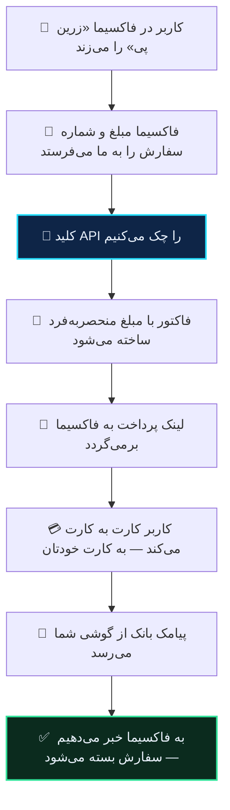

# فاکسیما

ربات فاکسیما می‌تواند آبان گیت وی را به‌عنوان درگاه پرداختش استفاده کند.

فاکسیما با DDbot و میرزا یک فرق مهم دارد: **روی سرور خودتان نصب است.** پس برخلاف آن دو، دو خط از کد ربات باید عوض شود. این کار را یک نصب‌کننده انجام می‌دهد و شما کدی نمی‌نویسید.

> [!WARNING]
> این نصب جای درگاه **زرین پی** را می‌گیرد. اگر از زرین پی استفاده می‌کنید، بعد از نصب کار نمی‌کند. توکن قبلی‌تان بک‌آپ می‌شود و با `--uninstall` برمی‌گردد.

## گام ۱ — ساخت اتصال در ربات

در **ربات آبان گیت وی**:

۱. **تنظیمات** ← **🤖 اتصال به ربات‌ها** ← **➕ اتصال ربات جدید** ← **فاکسیما**
۲. **دامنه‌ی ربات خودتان** را بفرستید.
۳. یک اسم برای اتصال بگذارید.

ربات به شما یک **توکن اتصال** (با `bot_`) و یک **کلید API** (با `fox_`) می‌دهد، به‌علاوه‌ی دستور نصب.

## گام ۲ — نصب

### الف) اگر به ترمینال دسترسی دارید (سرور اختصاصی، VPS)

وارد پوشه‌ی فاکسیما شوید — همان‌جا که `config.php` هست — و دستوری را که ربات داده اجرا کنید:

```bash
cd /var/www/faoxima
curl -fsSL https://abangateway.ir/faoxima/abangateway-faoxima.php -o abangateway-faoxima.php
php abangateway-faoxima.php --token=bot_… --key=fox_…
```

تمام. خروجی می‌گوید چه کرده.

### ب) اگر هاست اشتراکی دارید (سی‌پنل، دایرکت‌ادمین)

روی هاست ترمینال ندارید، پس همان فایل را از مرورگر اجرا می‌کنید.

۱. **فایل نصب را دانلود کنید:**
   [`abangateway-faoxima-1.1.0.zip`](https://abangateway.ir/faoxima/abangateway-faoxima-1.1.0.zip)

۲. **زیپ را باز کنید** — داخلش `abangateway-faoxima.php` و همین راهنماست.

۳. **در File Manager هاست، فایل `abangateway-faoxima.php` را در پوشه‌ی فاکسیما آپلود کنید.**

   کدام پوشه؟ همانی که ربات را در آن آپلود کرده‌اید. اگر مطمئن نیستید، دنبال پوشه‌ای بگردید که این سه تا کنار هم داخلش هستند:

   ```
   config.php        payment/        re/
   ```

   معمولاً `public_html` است یا یک پوشه داخل آن، مثل `public_html/Faoxima-0.0.2`.

   > [!TIP]
   > اگر فایل را در `public_html` بگذارید و ربات در زیرپوشه باشد، نصب‌کننده خودش پیدایش می‌کند و می‌گوید کدام را انتخاب کرده. لازم نیست دقیق باشید.

۴. **در مرورگر بازش کنید:**

   ```
   https://دامنه‌شما/Faoxima-0.0.2/abangateway-faoxima.php
   ```

   (اگر در `public_html` گذاشتید: `https://دامنه‌شما/abangateway-faoxima.php`)

۵. **فرم را پر کنید:**

   | فیلد | چه بگذارید |
   |---|---|
   | توکن اتصال | از پیام ربات، با `bot_` شروع می‌شود |
   | کلید API | از پیام ربات، با `fox_` شروع می‌شود |
   | آدرس سرور | **دست نزنید** — از قبل درست پر شده |

۶. **«نصب کن» را بزنید.**

۷. **فایل را از هاست پاک کنید.** هر کسی که آدرسش را حدس بزند می‌تواند بازش کند.

## نصب‌کننده دقیقاً چه می‌کند

۱. پوشه‌ی فاکسیما را پیدا و تأیید می‌کند. اگر نشناسد، **هیچ‌چیز را دست نمی‌زند**.
۲. از دو فایلی که عوض می‌شوند بک‌آپ زمان‌دار می‌گیرد، در `.abangateway-backup/`.
۳. در هر فایل **فقط یک خط** عوض می‌کند — آدرسی که ربات برای پرداخت صدا می‌زند:

   | فایل | چه چیزی |
   |---|---|
   | `re/rx/function/business_logic_1.php` | آدرس ساخت پرداخت |
   | `payment/ZarinPay/successful.php` | آدرس تأیید پرداخت |

۴. آدرس واقعی ربات را اندازه می‌گیرد، صفحه‌ی بازگشتش را تست می‌کند و در آبان گیت وی ثبت می‌کند.
۵. کلید را در تنظیمات خود ربات می‌نویسد و درگاه **زرین پی** را روشن می‌کند. توکن قبلی‌تان اول بک‌آپ می‌شود.
۶. یک تست واقعی به آبان گیت وی می‌زند و می‌گوید کار کرد یا نه.

هیچ فایلی جایگزین نمی‌شود و هیچ تابعی بازنویسی نمی‌شود. اگر فاکسیما را آپدیت کنید و آن دو خط سر جایشان باشند، همه‌چیز کار می‌کند.

## آپدیت فاکسیما یا تغییر پوشه

اگر نسخه‌ی جدید فاکسیما نصب کردید (مثلاً پوشه شد `Faoxima-0.0.3`)، نصب‌کننده را دوباره اجرا کنید. اتصال قبلی را می‌شناسد و آدرس را به پوشه‌ی جدید به‌روز می‌کند.

## برگرداندن به حالت قبل

```bash
php abangateway-faoxima.php --uninstall
```

یا در مرورگر، دکمه‌ی **«برگرداندن به حالت قبل»**.

فایل‌ها از بک‌آپ برمی‌گردند و توکن زرین پیِ قبلی‌تان دوباره در تنظیمات می‌نشیند.

## چه اتفاقی می‌افتد



فاکسیما به‌تنهایی فقط وقتی از پرداخت باخبر می‌شود که خریدار به صفحه‌ی بازگشت برگردد. اگر تب را ببندد، سفارش تا ابد باز می‌ماند. برای همین ما **خودمان هم** به ربات خبر می‌دهیم، همان لحظه که پیامک بانک می‌رسد.

## مبلغ

فاکسیما مبلغ را به تومان نگه می‌دارد و موقع صدا زدن درگاه به ریال تبدیل می‌کند. ما همان ریال را می‌گیریم و تبدیل دوباره‌ای در کار نیست.

چیزی که کاربر می‌پردازد چند ریال بیشتر از مبلغ سفارش است — همان اختلاف تصادفی که واریزش را قابل تشخیص می‌کند. [توضیح کامل](../guides/how-matching-works.md).

## چند ربات

هر اتصال توکن و کلید جدا دارد. اگر چند نصب فاکسیما دارید، برای هرکدام یک اتصال بسازید و نصب‌کننده را در پوشه‌ی همان یکی اجرا کنید.

## وقتی کار نمی‌کند

**«پوشه‌ی فاکسیما پیدا نشد»** — فایل جای درستی نیست. پیام خطا می‌گوید در کدام پوشه گشته؛ فایل را در پوشه‌ای بگذارید که `config.php` و `payment/` و `re/` داخلش هست.

**«آدرس مورد انتظار پیدا نشد»** — نسخه‌ی فاکسیمای شما با آنچه انتظار داریم فرق دارد، یا قبلاً آن فایل‌ها را دستی تغییر داده‌اید. چیزی عوض نشده؛ با پشتیبانی تماس بگیرید و نسخه‌تان را بگویید.

**«توکن اتصال شناخته نشد»** — توکن را دوباره از ربات کپی کنید. اتصال ممکن است حذف شده باشد.

**«صفحه‌ی بازگشت پرداخت جواب نداد»** — این مهم است: یعنی آدرس ربات درست تشخیص داده نشده و تأییدها نمی‌رسند. پرداخت‌ها انجام می‌شوند ولی سفارش بسته نمی‌شود. با پشتیبانی تماس بگیرید.

**«به دیتابیس وصل نشدم»** — نصب‌کننده نتوانست `config.php` را بخواند. فایل‌ها وصله خورده‌اند؛ فقط کلید را دستی بگذارید: **پنل ← مالی ← توکن زرین‌پی**، و **فعال‌سازی زرین‌پی** را روشن کنید.

**«گزینه‌ی پرداخت در ربات دیده نمی‌شود»** — در پنل فاکسیما، **مالی ← فعال‌سازی زرین‌پی** باید روشن باشد.

**«کیف پول کارمزد خالی است»** — فاکتور ساخته نمی‌شود و کاربر لینکی نمی‌بیند. [کارمزد](../guides/fees.md).

**«پرداخت شد ولی سفارش بسته نشد»** — این ربطی به فاکسیما ندارد و مسئله‌ی سمت گوشی است: [چرا پرداختم تأیید نشد](../guides/why-not-settled.md).

## نصب‌کننده چه چیزی می‌خواند

برای نوشتن کلید در تنظیمات ربات، `config.php` شما را می‌خواند تا به دیتابیس برسد. این اطلاعات هیچ‌جا فرستاده نمی‌شود و در هیچ لاگی نوشته نمی‌شود.

فایل عمداً ساده و خوانا نوشته شده تا بتوانید قبل از اجرا خودتان نگاهش کنید — [همین‌جا در مرورگر بازش کنید](https://abangateway.ir/faoxima/abangateway-faoxima.php).
