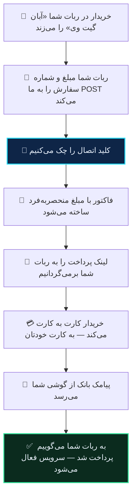

# میرزا (آپدیت‌شده)

از نسخه‌های جدید میرزا به بعد، **آبان گیت وی داخل خود ربات هست**. چیزی روی سرور شما نصب نمی‌شود، فایلی آپلود نمی‌کنید، و هیچ درگاه دیگری از کار نمی‌افتد.

> [!NOTE]
> اگر ربات شما قدیمی است و در تنظیمات پرداختش «آبان گیت وی» را نمی‌بینید، اول ربات را آپدیت کنید. تا قبل از آپدیت، این صفحه به کارتان نمی‌آید.
>
> نسخه‌ی دیگری از میرزا هم هست که درگاه سفارشی دارد و روش اتصالش فرق می‌کند — [میرزا قدیمی](mirza.md).

## اتصال

در **ربات آبان گیت وی**:

۱. **تنظیمات** ← **🤖 اتصال به ربات‌ها** ← **➕ اتصال ربات جدید** ← **میرزا آپدیت شده**
۲. دامنه‌ی ربات خودتان را بدهید.
۳. یک اسم بگذارید. ربات به شما **دو چیز** می‌دهد: یک آدرس درگاه، و یک کلید اتصال.

در **ربات خودتان**، مسیر **تنظیمات پرداخت ← 📌 آبان گیت وی**:

۴. **🔗 آدرس درگاه** ← آدرسی که گرفتید
۵. **🔑 کلید اتصال** ← کلیدی که گرفتید
۶. درگاه را **روشن** کنید

> [!WARNING]
> **کلید را همان لحظه کپی کنید.** رمزشده ذخیره می‌شود و دوباره نشانش نمی‌دهیم. اگر گمش کردید، اتصال را حذف و دوباره بسازید.

## تا هر سه‌تا نباشد، دکمه‌ای نیست

خریدار «💳 آبان گیت وی (کارت به کارت)» را فقط وقتی می‌بیند که هر سه شرط برقرار باشد:

| شرط | اگر نباشد |
|---|---|
| درگاه روشن است | دکمه ساخته نمی‌شود |
| کلید اتصال پر است | دکمه ساخته نمی‌شود |
| آدرس درگاه `https` است | دکمه ساخته نمی‌شود |

این عمدی است و به نفع شماست: درگاهی که نصفه تنظیم شده، خریدار را به صفحه‌ای می‌برد که ساخته نمی‌شود. دکمه آخرین جایی است که می‌شود این را فهمید.

آدرس درگاه باید `https` باشد. ربات آدرس `http` را نمی‌پذیرد و درگاه خاموش می‌ماند.

## چه اتفاقی می‌افتد

## چرا خبر دادن مهم‌تر از برگشتن خریدار است

بیشتر درگاه‌ها وقتی می‌فهمند پول رسیده که مرورگر خریدار برگردد. کارت به کارت این‌طور نیست: پیامک بانک ممکن است دقایقی بعد از بستن تب برسد.

پس ما **خبر را هم می‌فرستیم**، نه اینکه منتظر برگشتن خریدار بمانیم. اگر ربات شما در آن لحظه جواب ندهد، **پنج بار تلاش می‌شود** — بعد از ۱۰ ثانیه، ۳۰ ثانیه، ۲ دقیقه، ۱۰ دقیقه و ۱ ساعت. هر سفارش دقیقاً یک بار تأیید می‌شود.

## مبلغ

ربات مبلغ را به **تومان** می‌فرستد و ما همان‌جا به ریال تبدیل می‌کنیم. کاری از شما نمی‌خواهد؛ اینجا نوشته شده چون اگر عددی در گزارش‌ها ده‌برابر به نظر رسید، دلیلش همین است و اشتباه نیست.

**حداقل و حداکثر مبلغ** را در همان صفحه‌ی تنظیمات درگاه می‌گذارید. **کش‌بک** هم همان‌جاست.

## یک سفارش، یک فاکتور

اگر همان `order_id` دوباره بیاید، فاکتور دومی ساخته نمی‌شود و همان لینک قبلی برمی‌گردد. هر سفارش هم فقط یک بار اعتبار می‌گیرد، چه خریدار برگردد چه خبر ما زودتر برسد.

## چند ربات

هر اتصال آدرس و کلید جدا دارد. اگر چند ربات دارید، برای هرکدام یک اتصال بسازید.

## وقتی کار نمی‌کند

**«آبان گیت وی در تنظیمات پرداخت نیست»** — ربات آپدیت نشده. این درگاه از نسخه‌های جدید به بعد اضافه شده.

**«درگاه را روشن کردم ولی خریدار دکمه نمی‌بیند»** — یکی از آن سه شرط بالا برقرار نیست. محتمل‌ترین: آدرس درگاه `http` است، یا کلید خالی مانده.

**«کاربر پیام خطا می‌بیند»** — یعنی ما لینک معتبری برنگرداندیم. محتمل‌ترین دلیل: کلید اتصال با آنچه ما دادیم یکی نیست، یا آدرس درگاه ناقص کپی شده.

**«کیف پول کارمزد خالی است»** — فاکتور ساخته نمی‌شود و خریدار لینکی نمی‌بیند. [کارمزد](../guides/fees.md).

**«پول رسید ولی سرویس فعال نشد»** — تأیید در حال تلاش مجدد است یا ربات ردش کرده. با پشتیبانی تماس بگیرید؛ دلیل دقیق و همه‌ی تلاش‌ها ثبت شده.

**«پرداخت شد ولی فاکتور تأیید نشد»** — این ربطی به ربات ندارد و مسئله‌ی سمت گوشی است: [چرا پرداختم تأیید نشد](../guides/why-not-settled.md).
