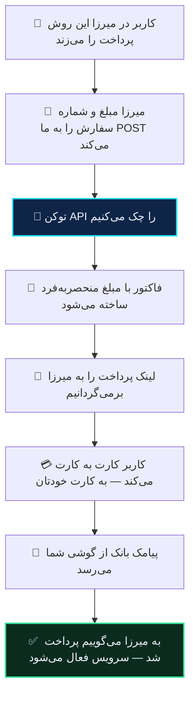

# میرزا (قدیمی)

> [!NOTE]
> این صفحه برای نسخه‌ای از میرزاست که **درگاه سفارشی** دارد — مسیر «مالی ← تنظیمات درگاه سفارشی».
>
> اگر در تنظیمات پرداخت رباتتان **«📌 آبان گیت وی»** را می‌بینید، نسخه‌ی جدیدتری دارید و اتصالش ساده‌تر است: [میرزا (آپدیت‌شده)](mirza-pro.md).

ربات میرزا می‌تواند آبان گیت وی را به‌عنوان درگاه سفارشی‌اش استفاده کند. **چیزی روی سرور شما نصب نمی‌شود** و کدی نمی‌نویسید — میرزا مستقیم با ما حرف می‌زند.

## اتصال

در **ربات آبان گیت وی**:

۱. **تنظیمات** ← **🤖 اتصال به ربات‌ها** ← **➕ اتصال ربات جدید** ← **میرزا**
۲. دامنه‌ی ربات خودتان را بدهید (همانی که پنل میرزا رویش بالا می‌آید).
۳. **توکن ربات** را بدهید — همان که با دستور `/token2` در میرزا می‌گیرید.
۴. یک اسم بگذارید. ربات به شما **دو چیز** می‌دهد: یک آدرس، و یک توکن API.

در **میرزا**، مسیر **مالی ← تنظیمات درگاه سفارشی**:

۵. **آدرس API** ← آدرسی که گرفتید
۶. **توکن API** ← توکنی که گرفتید

تمام.

> [!WARNING]
> **توکن API را همان لحظه کپی کنید.** رمزشده ذخیره می‌شود و دوباره نشانش نمی‌دهیم. اگر گمش کردید، اتصال را حذف و دوباره بسازید.

## دو توکن، و اشتباه نگرفتنشان

میرزا دو راز دارد که در جهت‌های مخالف کار می‌کنند. این شایع‌ترین جای اشتباه است:

| | چیست | چه کسی می‌سازد | کجا می‌رود |
|---|---|---|---|
| **توکن ربات** | همان که `/token2` می‌دهد | میرزا | به ما می‌دهید |
| **توکن API** | ثابت می‌کند درخواست از ربات شماست | ما | در تنظیمات میرزا می‌گذارید |

اگر جابه‌جا واردشان کنید، اتصال ساخته می‌شود ولی هیچ پرداختی کار نمی‌کند.

## چه اتفاقی می‌افتد

هر سه نوع تراکنش میرزا کار می‌کند: خرید سرویس، تمدید، و افزایش موجودی کیف پول.

## مبلغ

میرزا مبلغ را به **تومان** می‌فرستد و ما با **ریال** کار می‌کنیم. تبدیل خودکار است.

چیزی که کاربر می‌پردازد چند ریال بیشتر از مبلغ سفارش است — همان اختلاف تصادفی که واریزش را قابل تشخیص می‌کند. [توضیح کامل](../guides/how-matching-works.md).

## آنچه از کاربران شما نگه نمی‌داریم

میرزا در هر درخواست نام، نام کاربری، موجودی کیف پول و تعداد پرداخت‌های قبلی کاربر را می‌فرستد.

ما فقط **شناسه‌ی عددی تلگرام** و **نوع تراکنش** را نگه می‌داریم — به‌اندازه‌ای که اگر پرداختی گیر کرد بشود گفت مال کدام کاربر است. نام و نام کاربری اصلاً نوشته نمی‌شوند. داده‌ای که ذخیره نشود، نشت هم نمی‌کند.

## یک سفارش، یک فاکتور

اگر همان `order_id` دوباره بیاید، فاکتور دومی ساخته نمی‌شود و همان لینک قبلی برمی‌گردد.

این مهم‌تر از چیزی است که به نظر می‌رسد: برخلاف بعضی ربات‌ها، میرزا راهی ندارد که از آن بپرسیم «این سفارش قبلاً پرداخت شده؟». پس محافظت از پرداخت تکراری کاملاً سمت ماست.

## تأیید به میرزا

وقتی پیامک بانک رسید و فاکتور تسویه شد، خودکار به میرزا خبر می‌دهیم و سرویس کاربر فعال می‌شود.

اگر میرزا در آن لحظه جواب ندهد، **پنج بار تلاش می‌شود** — بعد از ۱۰ ثانیه، ۳۰ ثانیه، ۲ دقیقه، ۱۰ دقیقه و ۱ ساعت. هر سفارش دقیقاً یک بار تأیید می‌شود.

## چند ربات

هر اتصال آدرس و توکن جدا دارد. اگر چند ربات میرزا دارید، برای هرکدام یک اتصال بسازید.

## وقتی کار نمی‌کند

**«کاربر پیام خطا می‌بیند»** — یعنی ما لینک معتبری برنگرداندیم. محتمل‌ترین دلیل: توکن API در میرزا با آنچه ما دادیم یکی نیست، یا جای دو توکن عوض شده.

**«اتصال را ساختم ولی هیچ اتفاقی نمی‌افتد»** — در میرزا چک کنید که درگاه سفارشی فعال باشد و آدرس API کامل و بدون تغییر وارد شده باشد.

**«کیف پول کارمزد خالی است»** — فاکتور ساخته نمی‌شود و کاربر لینکی نمی‌بیند. [کارمزد](../guides/fees.md).

**«پول رسید ولی سرویس فعال نشد»** — تأیید در حال تلاش مجدد است یا میرزا ردش کرده. با پشتیبانی تماس بگیرید؛ دلیل دقیق و همه‌ی تلاش‌ها ثبت شده.

**«پرداخت شد ولی فاکتور تأیید نشد»** — این ربطی به میرزا ندارد و مسئله‌ی سمت گوشی است: [چرا پرداختم تأیید نشد](../guides/why-not-settled.md).
