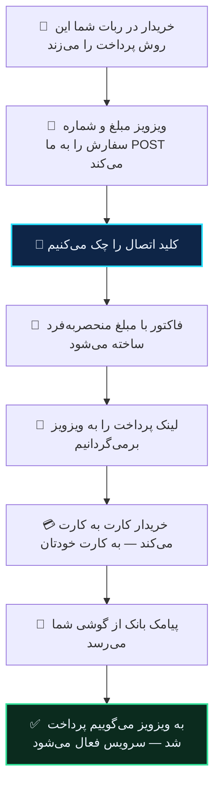

# ویزویز

ربات ویزویز (`wizwizxui-timebot`) می‌تواند آبان گیت وی را به‌عنوان درگاه پرداختش استفاده کند.

مثل فاکسیما، ویزویز **روی سرور خودتان نصب است**، پس چند رشته از کد ربات باید عوض شود. این کار را یک نصب‌کننده انجام می‌دهد و شما کدی نمی‌نویسید.

> [!WARNING]
> این نصب جای درگاه **NowPayments** را می‌گیرد. اگر از آن استفاده می‌کنید، بعد از نصب کار نمی‌کند. کلید قبلی‌تان بک‌آپ می‌شود و با `--uninstall` برمی‌گردد.

## چرا همان اسلات

ویزویز سه درگاه دارد و فقط یکی‌شان با عوض‌کردن چند رشته قابل‌جایگزینی است:

<div dir="rtl">

| درگاه | چرا شد / نشد |
|---|---|
| **NowPayments** | آدرس صفحه‌ی پرداخت را از جواب خودِ درگاه می‌خواند، و فایل بازگشتی‌اش `$_GET` را می‌خواند |
| درگاه دوم (بانکی) | آدرس خریدار را روی هاست همان درگاه هاردکد کرده |
| درگاه سوم (بانکی) | همین طور |

</div>

آن دو ویژگی تصادفی نیستند. اولی یعنی می‌شود خریدار را به صفحه‌ی ما فرستاد بدون دست‌زدن به `bot.php`. دومی یعنی وقتی پیامک بانک رسید و خریدار تا آن موقع تب را بسته بود، می‌شود تأیید را **به ربات فرستاد** — که در کارت‌به‌کارت حالت عادی است، نه استثنا.

`bot.php` با ۱۰٬۲۵۱ خطش اصلاً دست نمی‌خورد.

## گام ۱ — ساخت اتصال در ربات

در **ربات آبان گیت وی**:

۱. **تنظیمات** ← **🤖 اتصال به ربات‌ها** ← **➕ اتصال ربات جدید** ← **ویزویز**
۲. **دامنه‌ی ربات خودتان** را بفرستید — همانی که ویزویز رویش نصب است.
۳. یک اسم برای اتصال بگذارید.

ربات یک **توکن اتصال** (با `bot_`) و یک **کلید اتصال** (با `wiz_`) می‌دهد، به‌علاوه‌ی دستور نصب.

> [!TIP]
> همان‌جا آدرسی که دادید آزموده می‌شود. اگر ربات در پوشه‌ای زیر آن دامنه نصب باشد، خودش پیدایش می‌کند و می‌گوید. اگر هیچ‌جا پیدا نشد هشدار می‌دهد — این هشدار را جدی بگیرید: با آدرس غلط، فاکتور ساخته می‌شود و پول هم می‌رسد، ولی **محصول تحویل داده نمی‌شود** و هیچ خطایی نمی‌بینید.

## گام ۲ — نصب

### الف) اگر به ترمینال دسترسی دارید

وارد پوشه‌ی ویزویز شوید — همان‌جا که `bot.php` و `config.php` هستند:

```bash
cd /var/www/wizwiz
curl -fsSL https://abangateway.ir/wizwiz/abangateway-wizwiz.php -o abangateway-wizwiz.php
php abangateway-wizwiz.php --token=bot_… --key=wiz_…
rm abangateway-wizwiz.php
```

خروجی می‌گوید چه کرده.

### ب) اگر هاست اشتراکی دارید

همان فایل را از مرورگر اجرا می‌کنید:

۱. فایل را دانلود کنید: <https://abangateway.ir/wizwiz/abangateway-wizwiz.php>
۲. کنار `bot.php` آپلودش کنید.
۳. در مرورگر بازش کنید و توکن و کلید را بگذارید.
۴. **بعد از نصب، فایل را از هاست پاک کنید.**

## چه چیزی عوض می‌شود

چهار رشته، و نه بیشتر:

<div dir="rtl">

| فایل | چه چیزی |
|---|---|
| `pay/index.php` | نرخ تتر → عدد ۱. آبان گیت وی به ریال کار می‌کند، پس تقسیم بی‌اثر می‌شود — و یک درخواست به `api.tetherland.com` از مسیر پرداخت خریدار حذف می‌شود |
| `pay/index.php` | آدرس ساخت فاکتور |
| `pay/back.php` | آدرس تأیید پرداخت |
| `settings/values.php` | برچسب دکمه، که وگرنه بالای صفحه‌ی پرداختِ شما می‌نویسد «درگاه NowPayment» |

</div>

نصب‌کننده قبل از هر تغییری از هر چهار فایل بک‌آپ می‌گیرد، کلید را در جدول تنظیمات خود ربات می‌نویسد و درگاه را روشن می‌کند. برای برگرداندن همه‌چیز:

```bash
php abangateway-wizwiz.php --uninstall
```

## مبلغ

ویزویز مبلغ را به **تومان** نگه می‌دارد — همان چیزی که خودش در فراخوانی درگاه سوم با `currency=IRT` میفرستد. ما به ریال صورت‌حساب می‌کنیم و تبدیل دقیقاً یک‌بار، سمت ما، انجام می‌شود.

## چه اتفاقی می‌افتد



مرحله‌ی آخر دو راه دارد و هر دو لازم‌اند: اگر خریدار بعد از پرداخت به صفحه برگردد، خودِ ربات از ما می‌پرسد. اگر برنگردد — که در کارت‌به‌کارت معمول است — ما تأیید را برایش می‌فرستیم.

## بعد از آپدیت ربات

آپدیت ویزویز فایل‌ها را به نسخه‌ی خودش برمی‌گرداند، پس وصله‌ها می‌روند. نصب‌کننده را دوباره اجرا کنید؛ بی‌خطر است و دوباره اجرا شدنش مشکلی ندارد.

## اگر چیزی کار نکرد

<div dir="rtl">

| نشانه | معنی |
|---|---|
| فاکتور ساخته نمی‌شود | کلید اتصال یا آدرس اشتباه است — نصب‌کننده را دوباره اجرا کنید |
| فاکتور ساخته می‌شود، پرداخت می‌شود، ولی محصول نمی‌آید | آدرس ربات نزد ما غلط ثبت شده. نصب‌کننده را دوباره اجرا کنید؛ خودش آدرس واقعی را اندازه می‌گیرد و ثبت می‌کند |
| دکمه‌ی پرداخت اسم دیگری دارد | آپدیت، `settings/values.php` را برگردانده — نصب‌کننده را دوباره اجرا کنید |

</div>

---

**[راهنمای فاکسیما](faoxima.md)** · **[راهنمای میرزا](mirza.md)** · **[همه‌ی اتصال‌ها](../README.md)**
